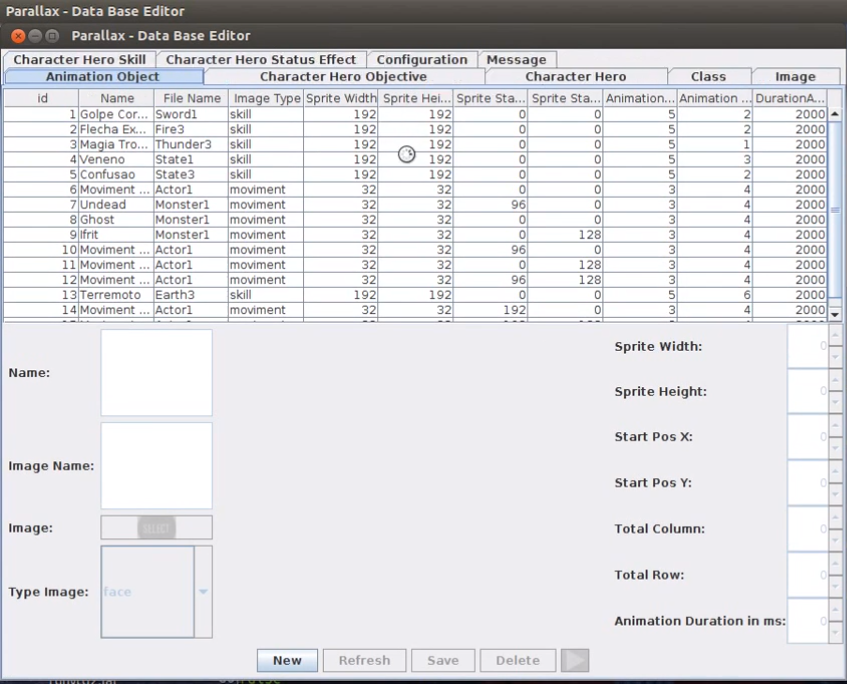
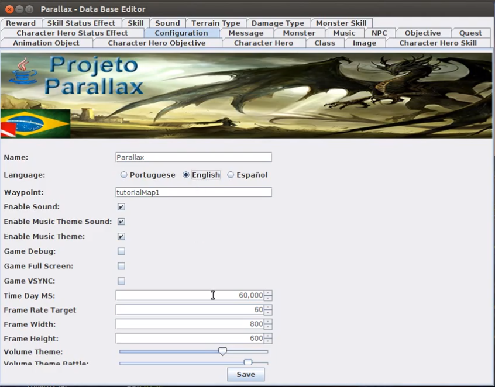

# <p align="center">Data Base Editor</p>

<br>


Escrito em Java utilizando Swing e Hibernate, criado para manipular o conteudo de um banco de dados Derby embarcado utilizado pelo [Projeto Parallax](https://sourceforge.net/projects/parallaxu/files/). 

## Motivação
Criei esse codigo para contruibuir com o projeto e aprender mais sobre o Java/Swing que proporciona uma portabilidade desktop.

## Build status
Totalmente completo em 2012.

## Code Example
```java
    public void setVolumeThemeBattle(Double volumethemebattle) {
        this.volumeThemeBattle = volumethemebattle;
    }
```    
## Installation
Deve ser compilado para funcionar, aqui temos apenas o codigo.

## API Reference

Toda documentação na pasta doc.

## Tests
Testes realizados por Joao Pedro

## How to use?
[Demonstração](https://www.youtube.com/watch?v=Btg0Pez6BSs).

## License
BSD 3
